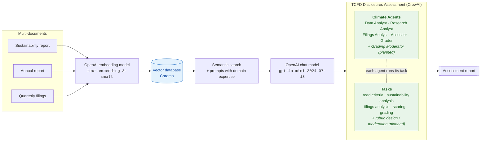
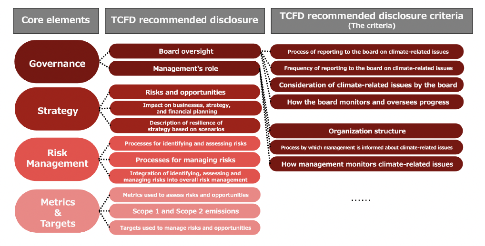
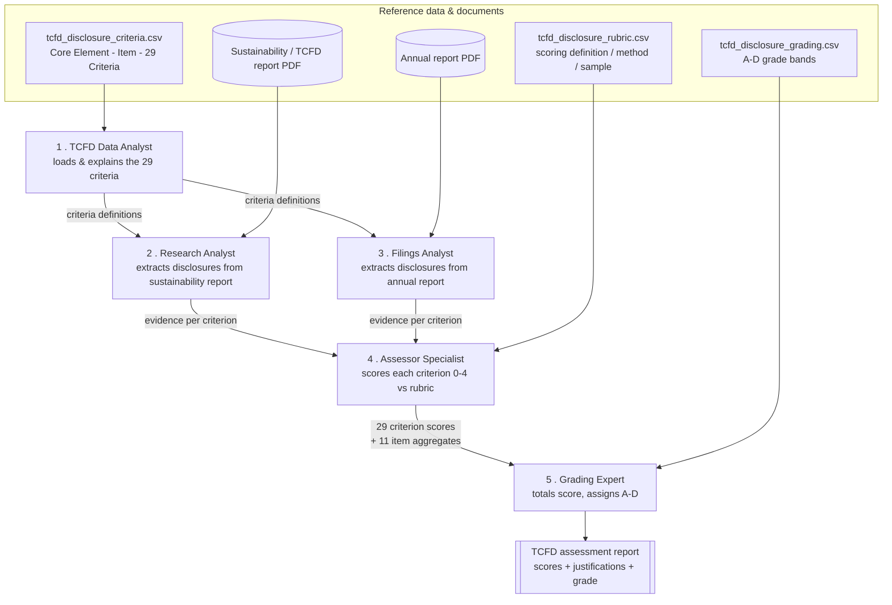
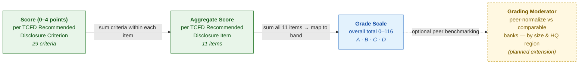
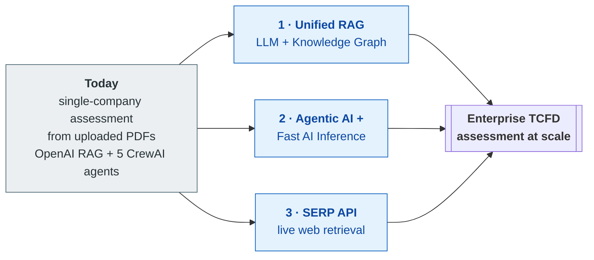

# ESG Agentic Platform

An **agentic AI platform for automated assessment of corporate climate disclosures** against the
[TCFD](https://www.fsb-tcfd.org/) (Task Force on Climate-related Financial Disclosures) recommendations.

The platform orchestrates a crew of role-playing AI agents (built with [CrewAI](https://github.com/crewAIInc/crewAI))
that read a company's sustainability and annual reports, map the contents against the TCFD recommended
disclosure criteria, score each criterion, and produce an overall disclosure grade — helping analysts
evaluate the completeness and quality of climate-related financial disclosures at scale.

> **Disclaimer:** This is a research/experimental project. Its output is an AI-generated assessment and
> should not be treated as professional, financial, legal, or compliance advice. Always have a qualified
> human review the results.

## How it works

### Architecture: RAG & multi-agent framework

At a high level, the platform combines **retrieval-augmented generation (RAG)** over the company's
documents with a **CrewAI multi-agent** assessment. Reports are embedded into a vector database; agents
retrieve the relevant passages via semantic search and reason over them with an LLM to produce the
assessment report:



**Pipeline stages:**

1. **Ingest** — the supplied report PDFs (sustainability, annual, and optionally quarterly filings) are the
   source documents.
2. **Embed** — text is converted to vectors with OpenAI's `text-embedding-3-small` model.
3. **Store** — embeddings are held in a local **Chroma** vector database (created on first run under
   `agents/db/`, which is git-ignored).
4. **Retrieve** — for each question, semantic search pulls the most relevant passages; domain-expert prompts
   frame the task for the LLM (this is the `PDFSearchTool` RAG step).
5. **Reason** — the `gpt-4o-mini-2024-07-18` chat model answers grounded in the retrieved text.
6. **Assess** — the CrewAI **agents** each execute their **task** in sequence (see the pipeline below),
   producing the final **assessment report**.

> The RAG models above are the defaults; see [Configuration](#configuration) to swap in another LLM or
> embedding provider. The *Grading Moderator* agent and the *rubric-design* / *moderation* tasks shown as
> "planned" are part of the intended design but are **not wired into the current pipeline**.

Five specialized agents collaborate in a pipeline:

| Agent | Role | Input |
| --- | --- | --- |
| **TCFD Data Analyst** | Loads and interprets the TCFD recommended disclosure criteria and their definitions | `tcfd_disclosure_criteria.csv` |
| **TCFD Disclosure Research Analyst** | Extracts climate-related disclosures from a company's ESG / CSR / sustainability / TCFD reports | Sustainability report PDF |
| **Filings Research Analyst** | Extracts climate-related disclosures from a company's annual report | Annual report PDF |
| **TCFD Disclosure Assessor Specialist** | Scores each of the TCFD recommended disclosure criteria (0–4) against a scoring rubric, critically screening for greenwashing and unsubstantiated "cheap talk" | `tcfd_disclosure_rubric.csv` + report PDFs |
| **TCFD Disclosure Grading Expert** | Aggregates criterion scores into the 11 recommended-disclosure-item scores and assigns an overall grade (A–D) | `tcfd_disclosure_grading.csv` |

The final output is a report containing per-criterion scores with justifications, aggregated
disclosure-item scores, an overall score (0–116), and a letter grade.

### TCFD recommended disclosures & criteria

The [TCFD](https://www.fsb-tcfd.org/) framework is organized as a three-level hierarchy. This project builds
on it — following the approach in the JPX and TCFD reference documents (see [References](#references)) — by
subdividing the 11 recommended disclosures into **29 fine-grained, individually-scorable criteria**:

- **4 Core Elements** — the themes every organization should report on:
  **Governance**, **Strategy**, **Risk Management**, and **Metrics & Targets**.
- **11 Recommended Disclosures** — the specific disclosures TCFD recommends under those elements
  (e.g. *"Board oversight"*, *"Management's role"* under Governance).
- **29 Recommended Disclosure Criteria** ("the Criteria") — a more detailed, measurable breakdown of each
  disclosure, so the assessment can evaluate *how well* each recommendation is met rather than just whether
  it is mentioned (e.g. *"Board oversight"* expands into criteria such as *"Process of reporting to the
  board on climate-related issues"* and *"Frequency of reporting to the board"*).

<p align="center">
  
</p>

<sub>Structure of the TCFD framework — Core Elements → Recommended Disclosures → the 29 Criteria. Source:
Doi, N., Oda, Y., Nakakubo, N., & Sugimoto, J. (2024). *Automated Determination of TCFD Recommended
Disclosures through Zero-shot Text Classification Using Large Language Models.* Japan Exchange Group (JPX)
Working Paper Vol. 43. See [References](#references).</sub>

The number of criteria per core element is not uniform — it reflects how many measurable points each
disclosure breaks into:

| Core Element | Recommended Disclosures | Criteria |
| --- | :---: | :---: |
| Governance | 2 | 7 |
| Strategy | 3 | 10 |
| Risk Management | 3 | 5 |
| Metrics & Targets | 3 | 7 |
| **Total** | **11** | **29** |

Each criterion carries a **definition** (and guidance for financial vs. non-financial reporters) describing
exactly what a compliant disclosure looks like — this is what the agents assess a company's reports against.
The framework is also improved with pathways and guidance tailored to financial-sector and non-financial
organizations for each disclosure item.

### The TCFD reference data

The assessment is driven by three CSV files that ship with the repo. They encode the TCFD framework as the
same three-level hierarchy — **Core Element → Recommended Disclosure Item → Recommended Disclosure Criterion** —
plus the rules for scoring and grading:

| File | What it defines | Consumed by |
| --- | --- | --- |
| `tcfd_disclosure_criteria.csv` | The TCFD framework itself: each Core Element, its 11 Recommended Disclosure Items, and the 29 fine-grained Criteria, each with definitions and guidelines. This is the **checklist** of what a company should disclose. | TCFD Data Analyst |
| `tcfd_disclosure_rubric.csv` | For every criterion: a **scoring definition** (what to measure), a **scoring method** (how to assign 0–4), and a **sample answer** (the benchmark for full marks). This turns the checklist into a **gradebook**. | TCFD Disclosure Assessor Specialist |
| `tcfd_disclosure_grading.csv` | The **grade bands** that map a total score (0–116) to a letter grade A–D. | TCFD Disclosure Grading Expert |

So the criteria file says *what* to look for, the report PDFs supply *the evidence*, the rubric says *how
to score each piece of evidence*, and the grading file says *how to turn the total into a grade*.

### How the agents work together

The five agents run as a **sequential pipeline** (defined in `main.py` / `streamlit_app.py`). Each agent's
output becomes context for the ones after it, so knowledge flows left-to-right: the framework is loaded,
evidence is gathered from two report sources, the evidence is scored against the rubric, and the scores are
finally graded.



**Step by step:**

1. **TCFD Data Analyst** reads `tcfd_disclosure_criteria.csv` and produces a structured explanation of the
   29 criteria and their definitions — establishing the shared checklist the downstream agents work against.
2. **Research Analyst** searches the **sustainability / TCFD report** for disclosures that map to each
   criterion, quoting the supporting text.
3. **Filings Analyst** does the same against the **annual report**, so evidence is drawn from both document
   types.
4. **Assessor Specialist** takes the gathered evidence and, using `tcfd_disclosure_rubric.csv`, scores each
   of the 29 criteria **0–4**. For every criterion the rubric supplies three things — a *scoring definition*
   (what to measure), a *scoring method* (how to map the evidence to a 0–4 score), and a *sample answer*
   (the benchmark for full marks) — and the agent critically screens for greenwashing and unsubstantiated
   "cheap talk". It then aggregates the criterion scores into the 11 disclosure-item scores.
   *Input:* evidence from steps 2–3 + the rubric. *Output:* 29 criterion scores + 11 item aggregates.
5. **Grading Expert** sums the 11 item scores into an overall total and maps it to a letter grade using the
   bands in `tcfd_disclosure_grading.csv`. Because there are 29 criteria scored 0–4, the maximum total is
   `29 × 4 = 116`. *Input:* the item scores + the grading bands. *Output:* the overall score and grade.

   | Grade | Overall score |
   | --- | --- |
   | **A** | 87–116 |
   | **B** | 58–86 |
   | **C** | 29–57 |
   | **D** | 0–28 |

### Scoring & grading rubric model

The assessment escalates through three levels — a fine-grained **criterion score** rolls up into a
**disclosure-item aggregate**, and the sum of all items maps to an overall **grade**:



- **Score (0–4)** — the Assessor grades each of the **29 criteria** against `tcfd_disclosure_rubric.csv`.
- **Aggregate Score** — criterion scores are summed within each of the **11 disclosure items**.
- **Grade Scale** — the Grading Expert totals the items (max 116) and assigns **A–D** per
  `tcfd_disclosure_grading.csv`.
- **Grading Moderator** *(planned, not yet in code)* — a further step that normalizes a company's grade
  against comparable peers (e.g. by bank size and HQ region) using the moderating dataset in `references/`.
  This mirrors the design in the [Auzepy et al. (2023)](https://arxiv.org/abs/2302.00326) reference but is
  **not implemented** in the current 5-agent pipeline.

## Project structure

```
esg-agentic-platform/
├── agents/
│   ├── main.py               # CLI entry point
│   ├── streamlit_app.py      # Streamlit web UI
│   ├── climate_agents.py     # Agent definitions (the "crew")
│   ├── climate_tasks.py      # Task/prompt definitions for each agent
│   ├── pdf_tools.py          # PDF search tool
│   ├── tools/                # Search, load, calculator, browser, PDF tools
│   ├── tcfd_disclosure_criteria.csv   # TCFD criteria & definitions
│   ├── tcfd_disclosure_rubric.csv     # Scoring rubric
│   ├── tcfd_disclosure_grading.csv    # Grading scale
│   ├── requirements.txt
│   └── pyproject.toml
├── .env.example              # Template for required API keys
├── .gitignore
├── LICENSE
└── README.md
```

## Prerequisites

- Python **3.10 or 3.11** (see `agents/pyproject.toml`)
- An [OpenAI API key](https://platform.openai.com/api-keys) — used by default (the agents run on GPT-4o-mini
  with OpenAI embeddings). CrewAI is model-agnostic, so this is **not strictly required**: you can swap in
  another LLM instead (e.g. Anthropic Claude, Google Gemini, Azure OpenAI, or a local model via
  [Ollama](https://ollama.com/)). See [Configuration](#configuration) for how to change the model — note
  that the PDF-search tool also uses an embedding model, so a provider offering embeddings (or a separate
  embeddings key) is needed for that step.
- A [Serper API key](https://serper.dev/) (for the internet-search tool)

## Setup

```bash
# 1. Clone
git clone https://github.com/robinmak/esg-agentic-platform.git
cd esg-agentic-platform

# 2. Configure API keys
cp .env.example .env
# then edit .env and fill in your keys

# 3. Install dependencies
cd agents
pip install -r requirements.txt          # or: poetry install --no-root
```

### Provide the report documents

The report PDFs are **not included** in this repository (they are third-party corporate documents and
are excluded via `.gitignore`). Download the two reports you want to analyze and tell the app where they
are — no code changes required. The paths are read from environment variables:

| Variable | What it points to | Default |
| --- | --- | --- |
| `TCFD_SUSTAINABILITY_REPORT` | ESG / CSR / sustainability / TCFD report PDF | `./sustainability_report.pdf` |
| `TCFD_ANNUAL_REPORT` | Annual report PDF | `./annual_report.pdf` |
| `TCFD_CRITERIA_CSV` | TCFD criteria & definitions (ships with repo) | `./tcfd_disclosure_criteria.csv` |
| `TCFD_RUBRIC_CSV` | Scoring rubric (ships with repo) | `./tcfd_disclosure_rubric.csv` |
| `TCFD_GRADING_CSV` | Grading scale (ships with repo) | `./tcfd_disclosure_grading.csv` |

You can set the two report paths in your `.env` file, pass them as CLI arguments, or (in the Streamlit
app) upload the PDFs directly through the browser — see **Running** below. The CSV rubric files ship with
the repo and rarely need to change.

## Running

**CLI** — pass the report paths as flags, or you'll be prompted for them:

```bash
cd agents
python main.py \
  --company "DBS" \
  --sustainability-report /path/to/sustainability_report.pdf \
  --annual-report /path/to/annual_report.pdf

# or just run it and answer the prompts:
python main.py
```

**Streamlit web UI** — enter the company name and upload the two report PDFs in the sidebar:

```bash
cd agents
streamlit run streamlit_app.py
```

> ⚠️ **Cost note:** Running the crew makes multiple calls to the OpenAI API (LLM + embeddings) and will
> incur usage charges on your account.

## Configuration

- **Model:** All agents default to `gpt-4o-mini` via `ChatOpenAI` in `agents/climate_agents.py`. CrewAI is
  model-agnostic, so you can point the agents at a different LLM by replacing the `ChatOpenAI(...)` instance
  passed to each agent's `llm=` argument. For example:
  - **Anthropic Claude** — `from langchain_anthropic import ChatAnthropic; llm = ChatAnthropic(model="<claude-model>")`
  - **Google Gemini** — `from langchain_google_genai import ChatGoogleGenerativeAI; llm = ChatGoogleGenerativeAI(model="<gemini-model>")`
  - **Azure OpenAI** — `from langchain_openai import AzureChatOpenAI`

  Install the matching LangChain integration package and set that provider's API key in your `.env`.
  Pick a current model name from your chosen provider's documentation.
- **Local models:** CrewAI supports local models via [Ollama](https://ollama.com/). Pass an Ollama
  LLM instance to the `llm=` argument of an agent to run it fully offline.
- **Embeddings:** The PDF-search tool (`_pdf_search_tool` in `agents/climate_agents.py`) also uses an
  embedding model — OpenAI's `text-embedding-3-small` by default. If you move off OpenAI entirely, update
  the `embedder` config there to a provider your setup supports (e.g. Ollama or Google embeddings).

## Vision & roadmap

Today this project assesses **one company at a time** from a handful of uploaded PDFs. The vision is to
scale it into an **enterprise-grade TCFD assessment platform** capable of continuously evaluating large
portfolios of companies. Three pillars drive that scaling:



### 1. Unified RAG (LLM + Knowledge Graph)

Move beyond flat vector search to a **unified RAG** layer that pairs the vector store with a **knowledge
graph**. Modeling companies, reports, disclosures, metrics, and their relationships as a graph adds *deep,
dynamic context* — enabling multi-hop questions ("compare Scope 1 targets across a company's last three
reports", "which subsidiaries lack board-oversight disclosures?") and stronger grounding/traceability than
embeddings alone. *Current state: single Chroma vector DB per run.*

### 2. Agentic AI with fast AI inference

The multi-agent pipeline is inference-heavy — every criterion involves retrieval plus LLM reasoning. Scaling
to portfolios means optimizing for **throughput and latency**: routing work to fast-inference hardware
(e.g. **LPU**-class accelerators alongside GPUs), batching agent calls, caching embeddings, and running
company assessments in parallel. This keeps cost and turnaround viable when assessing hundreds of companies
rather than one. *Current state: sequential agents on a single LLM endpoint.*

### 3. Search Engine Results Page (SERP) API

Broaden the evidence base from user-supplied PDFs to **live web retrieval** via a **SERP API** (Google,
Bing, DuckDuckGo, Yandex, …), returning structured HTML/JSON. This lets agents automatically discover and
pull the latest sustainability reports, filings, and news for any company — reducing manual document
gathering and keeping assessments current. *Current state: a `Serper`-based `search_internet` tool exists in
`agents/tools/search_tools.py` but is not yet part of the assessment pipeline.*

### Other directions

- **Grading Moderator** — implement the peer-normalization agent (by bank size / HQ region) shown as
  "planned" in the diagrams above, using the moderating dataset.
- **Multi-framework** — extend beyond TCFD to adjacent frameworks (ISSB/IFRS S2, ESRS, SASB).
- **Batch & API** — a service/API mode for scheduled, portfolio-wide runs with persisted results.
- **Human-in-the-loop review** — reviewer UI to accept/override agent scores before sign-off.

> This roadmap is aspirational and describes intended direction, not shipped functionality.

## Security

Do **not** commit API keys. Keys are read from a local `.env` file (ignored by git). If you ever expose a
key, rotate it immediately in the provider's dashboard.

## References

This project's approach to automated TCFD disclosure analysis and scoring draws on the following
frameworks, academic research, and datasets. The source documents are kept locally in the `references/`
directory (not committed to the repository, as they are third-party copyrighted material).

**Framework & guidance**

- Task Force on Climate-related Financial Disclosures (TCFD). *Implementing the Recommendations of the
  Task Force on Climate-related Financial Disclosures* (Annex, amended December 2017). Financial Stability
  Board. — `FINAL-TCFD-Annex-Amended-121517.pdf`
- *Financial institutions' climate-related disclosure* guidance document. — `financial-institutions-climate-related-disclosure-document.pdf`

**Academic research**

- Ni, J., Bingler, J., Colesanti-Senni, C., Kraus, M., Gostlow, G., Schimanski, T., Stammbach, D.,
  Ashraf Vaghefi, S., Wang, Q., Webersinke, N., Wekhof, T., Yu, T., & Leippold, M. (2023).
  *CHATREPORT: Democratizing Sustainability Disclosure Analysis through LLM-based Tools.*
  [arXiv:2307.15770](https://arxiv.org/abs/2307.15770). — `CHATREPORT - Democratizing Sustainability Disclosure Analysis.pdf`
- Auzepy, A., Tönjes, E., Lenz, D., & Funk, C. (2023). *Evaluating TCFD Reporting: A New Application of
  Zero-Shot Analysis to Climate-related Financial Disclosures.*
  [arXiv:2302.00326](https://arxiv.org/abs/2302.00326). — `Evaluating TCFD reporting - A new application of zero-shot analysis to climate-related financial disclosures.pdf`
- Doi, N., Oda, Y., Nakakubo, N., & Sugimoto, J. (2024, March 4). *Automated Determination of TCFD
  Recommended Disclosures through Zero-shot Text Classification Using Large Language Models.*
  Japan Exchange Group (JPX) Working Paper Vol. 43.
  [PDF](https://www.jpx.co.jp/english/corporate/research-study/working-paper/JPXWP_Vol43e.pdf) ·
  [news release](https://www.jpx.co.jp/english/corporate/news/news-releases/0010/20240304-01.html).
  — `JPX - Automated Determination of TCFD Recommended Disclosures through Zero-shot Text Classification Using LLMs.pdf`

**Datasets**

- *TCFD disclosures dataset* used for moderating/benchmarking TCFD disclosure scores. —
  `tcfd_disclosures_dataset for moderating TCFD disclosure score.csv`

## Acknowledgements

- Built on the [CrewAI](https://github.com/crewAIInc/crewAI) multi-agent framework.
- The Streamlit output-streaming helper (`StreamToExpander`) is adapted from
  [@AbubakrChan](https://github.com/AbubakrChan/crewai-UI-business-product-launch).
- The TCFD recommendations are published by the [Task Force on Climate-related Financial Disclosures](https://www.fsb-tcfd.org/).

## License

Released under the [MIT License](LICENSE).
